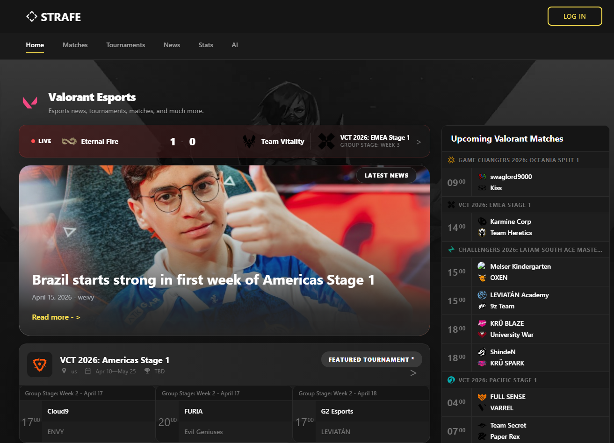
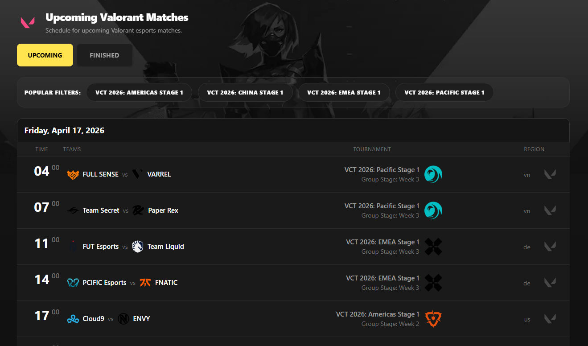
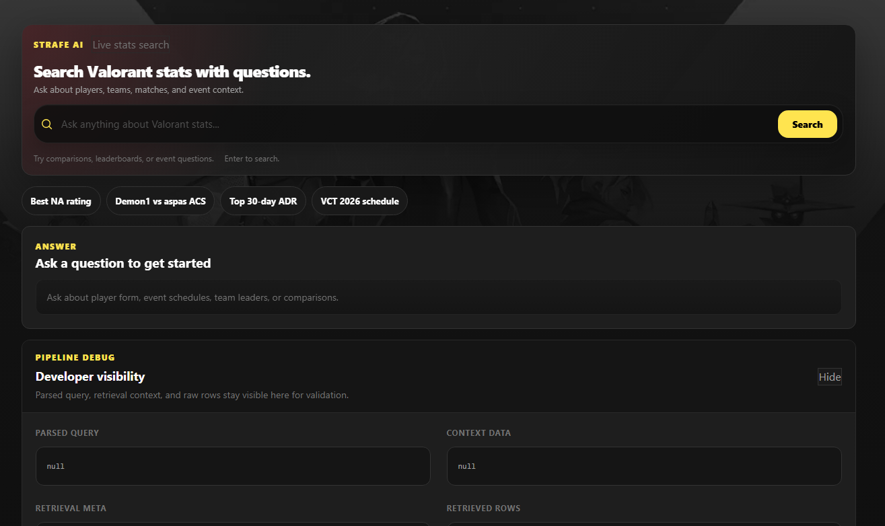

# Strafe Next

A Valorant esports web app focused on turning fragmented competitive data into a polished, stats-driven product experience.

Built with Next.js, React, Supabase, and OpenAI, this project combines live match coverage, tournament browsing, cached news, player stat exploration, and AI-assisted search in one app.

Live site: https://main.dj5wgqe9zayl7.amplifyapp.com/

## Overview

Strafe Next is a full-stack esports project built around a simple goal: make Valorant data feel easier to explore.

Instead of treating match schedules, tournament listings, news, and stat lookups as separate tools, the app brings them together into a single interface with:

- live and upcoming matches
- tournament tracking
- cached news feeds
- leaderboard-style player stats
- natural-language AI search for stats and event questions

## Screenshots

### Home page



The home page brings the product together in one place. It highlights live match coverage, featured news, tournaments, and recent results so users can quickly understand what is happening across the Valorant esports scene without jumping between separate tools.

### Matches experience



The matches view is designed to make live and upcoming Valorant coverage feel easy to scan. It groups match data into a more productized schedule experience, with tournament context, team branding, live state, and cleaner navigation into match detail pages.

### AI assistant experience



The AI assistant view shows how natural-language search fits into the product. Users can ask questions about players, teams, matches, and events, and the app returns a concise answer grounded in structured stats, along with supporting rows and retrieval metadata for transparency.

## What makes the project interesting

- It blends traditional app UI with data synchronization workflows, not just static frontend pages.
- It uses Supabase as both an application backend and a storage/cache layer for esports content.
- It supports AI answers grounded in structured data rather than purely freeform responses.
- It includes background refresh patterns for stale event and match data.
- It was built as a product-style experience, not just an API demo or isolated dashboard.

## Core features

- Home page that surfaces live matches, featured news, tournaments, and recent results
- Dedicated match and tournament pages with detail routes
- News page backed by cached storage data
- Stats page with filters for region, agent, rounds, rating, and timespan
- AI assistant page for leaderboard, player, team, match, and event questions
- Supabase-backed auth context for account flows

## Tech stack

- Next.js 15 App Router
- React 19
- TypeScript
- Tailwind CSS 4
- Supabase
- OpenAI API
- Axios
- Cheerio
- Day.js
- Zod

## Architecture highlights

Frontend:

- App Router-based Next.js application
- Reusable UI components for matches, tournaments, news, filters, and AI results
- Client-side stat filtering and AI interaction flows

Backend and data:

- Server routes for OpenAI responses, storage reads, sync triggers, and content proxying
- Supabase tables for events, matches, match details, player stats, and cached news
- Refresh logic for stale tournament and match data

AI flow:

- User question is parsed into a structured query
- Relevant stats or event context are retrieved from stored data
- OpenAI generates a concise answer from that structured context
- Supporting rows and debug metadata can be shown in the UI

## Main routes

User-facing:

- `/`
- `/matches`
- `/matches/[id]/[slug]`
- `/tournaments`
- `/tournaments/[id]/[slug]`
- `/news`
- `/stats`
- `/ai`

API routes:

- `/api/openai`
- `/api/ai/sync-stats`
- `/api/storage/events`
- `/api/storage/matches`
- `/api/storage/event-stats`
- `/api/storage/match-details/[matchId]`
- `/api/storage/news`
- `/api/storage/sync`
- `/api/matches/[id]/[slug]`
- `/api/tournaments/[id]/[slug]`
- `/api/proxy`
- `/api/newsImg`
- `/api/scrapeTournamentStats`

## Local setup

Create `.env.local`:

```env
NEXT_PUBLIC_SUPABASE_URL=
NEXT_PUBLIC_SUPABASE_ANON_KEY=
SUPABASE_SERVICE_ROLE_KEY=
OPENAI_API_KEY=
VLR_API_BASE_URL=
NEXT_PUBLIC_BASE_URL=
AI_SYNC_SECRET=
SYNC_SECRET=
```

Install and run:

```bash
npm install
npm run dev
```

Open `http://localhost:3000`.

## Scripts

```bash
npm run dev
npm run build
npm run start
npm run lint
npm run sync:ai:stats
npm run sync:tournament-storage
```

Extra sync examples:

```bash
node scripts/sync-tournament-match-storage.mjs 2787,2863
node scripts/sync-tournament-match-storage.mjs all true
```

## Project goals

- Build a more productized esports experience than a simple stats table or API wrapper
- Explore how structured retrieval can improve AI answer quality
- Create a scalable base for richer Valorant coverage over time

## Related docs

- `docs/tournament-match-storage.md`
- `docs/ai-sync-scheduler.md`

## Deployment

The repo includes `amplify.yml`, and the current deployment setup is aligned with AWS Amplify.

Production URL: https://main.dj5wgqe9zayl7.amplifyapp.com/
